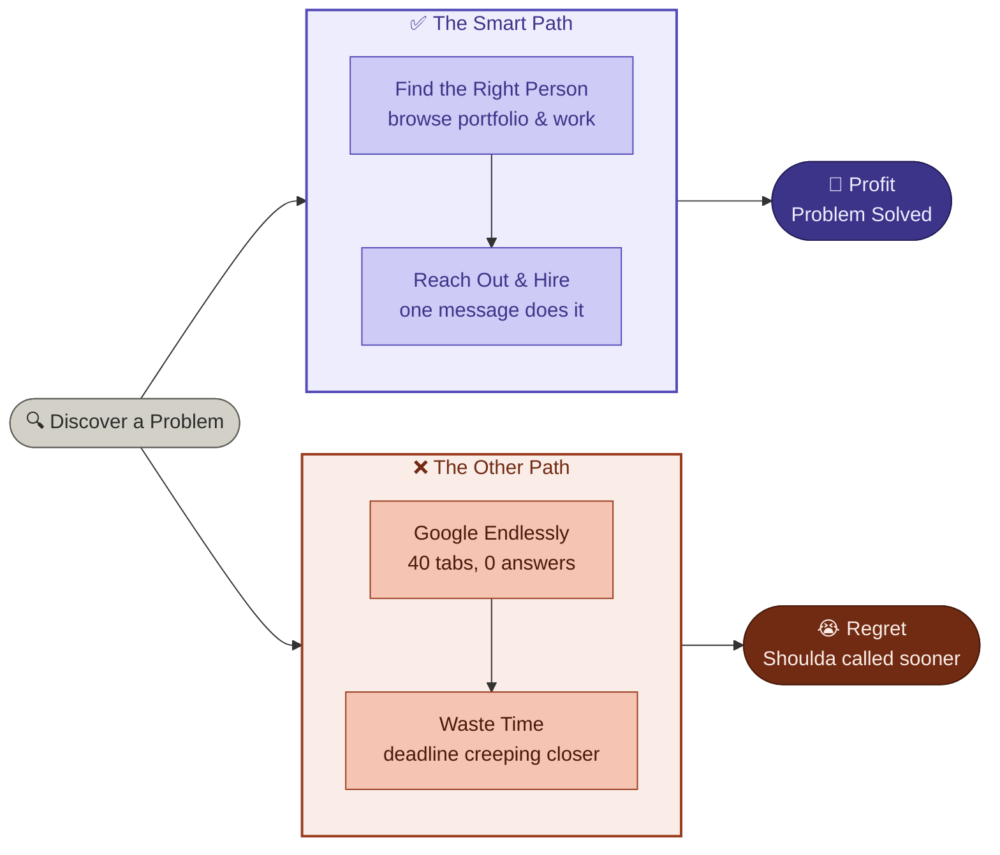

<h2 align="left">🚀 Most Recent Projects</h2>
<table>
<tr>
<th width="30%">Project</th>
<th width="70%">Preview</th>
</tr>
<tr>
<td align="center">
<h4><b>KlarityOS</b></h4>
Smart Finance Dashboard UI for Invoices, Transactions
</td>
<td align="center">

</td>
</tr>
<tr>
<td align="center">
<h4><b>NeuMoney</b></h4>
Smart Finance App for Students
</td>
<td align="center">

</td>
</tr>
<tr>
<td align="center">
<h4><b>Waypoint</b></h4>
Your AI Travel Planning Assistant
</td>
<td align="center">

</td>
</tr>
<tr>
<td align="center">
<h4><b>ControlCase</b></h4>
Compliance & Cybersecurity Platform Redesign
</td>
<td align="center">

</td>
</tr>
</table>

<h2>💻 Skills & Expertise</h2>
<h3>🖥️ Languages</h3>
<table>
<tr>
<th>Technology</th>
<th>Icon</th>
<th>Technology</th>
<th>Icon</th>
</tr>
<tr>
<td>JavaScript</td>
<td></td>
<td>TypeScript</td>
<td></td>
</tr>
<tr>
<td>Java</td>
<td></td>
<td>.NET / C#</td>
<td></td>
</tr>
<tr>
<td>Python</td>
<td></td>
<td>Go</td>
<td></td>
</tr>
</table>
<h3>⚛️ Frontend</h3>
<table>
<tr>
<th>Technology</th>
<th>Icon</th>
<th>Technology</th>
<th>Icon</th>
</tr>
<tr>
<td>ReactJS</td>
<td></td>
<td>NextJS</td>
<td></td>
</tr>
<tr>
<td>Angular</td>
<td></td>
<td>VueJS</td>
<td></td>
</tr>
<tr>
<td>Tailwind CSS</td>
<td></td>
<td>Figma</td>
<td></td>
</tr>
</table>
<h3>🟢 Backend</h3>
<table>
<tr>
<th>Technology</th>
<th>Icon</th>
<th>Technology</th>
<th>Icon</th>
</tr>
<tr>
<td>NodeJS</td>
<td></td>
<td>NestJS</td>
<td></td>
</tr>
<tr>
<td>Express</td>
<td></td>
<td>Spring Boot (Java)</td>
<td></td>
</tr>
<tr>
<td>ASP.NET Core</td>
<td></td>
<td>Django</td>
<td></td>
</tr>
<tr>
<td>FastAPI</td>
<td></td>
<td>Go / Gin</td>
<td></td>
</tr>
<tr>
<td>GraphQL</td>
<td></td>
<td>REST APIs</td>
<td>🔗</td>
</tr>
</table>
<h3>📱 Mobile Development</h3>
<table>
<tr>
<th>Technology</th>
<th>Icon</th>
<th>Technology</th>
<th>Icon</th>
</tr>
<tr>
<td>iOS (Swift)</td>
<td></td>
<td>Android (Kotlin)</td>
<td></td>
</tr>
<tr>
<td>React Native</td>
<td></td>
<td>Flutter</td>
<td></td>
</tr>
<tr>
<td>Expo</td>
<td>📦</td>
<td></td>
<td></td>
</tr>
</table>
<h3>🚀 Mobile Deployment Platforms</h3>
<table>
<tr>
<th>Platform</th>
<th>Description</th>
</tr>
<tr>
<td>🍎 App Store (iOS)</td>
<td>Publishing & distribution for iPhone and iPad apps via Apple's App Store Connect</td>
</tr>
<tr>
<td>🤖 Google Play Store</td>
<td>Android app publishing, release tracks (internal, alpha, beta, production)</td>
</tr>
<tr>
<td> Firebase</td>
<td>App distribution, crash reporting (Crashlytics), push notifications, analytics</td>
</tr>
<tr>
<td>🛠️ Microsoft App Center</td>
<td>CI/CD, automated builds, testing, and distribution for iOS & Android</td>
</tr>
<tr>
<td>⚡ Fastlane</td>
<td>Automated signing, building, testing, and releasing to App Store & Google Play</td>
</tr>
<tr>
<td>📦 Expo EAS Build</td>
<td>Cloud builds and OTA updates for React Native / Expo apps</td>
</tr>
</table>
<h3>🗄️ Database</h3>
<table>
<tr>
<th>Technology</th>
<th>Icon</th>
<th>Technology</th>
<th>Icon</th>
</tr>
<tr>
<td>MongoDB</td>
<td></td>
<td>MySQL</td>
<td></td>
</tr>
<tr>
<td>PostgreSQL</td>
<td></td>
<td>Redis</td>
<td></td>
</tr>
</table>
<h3>☁️ Cloud & DevOps</h3>
<table>
<tr>
<th>Technology</th>
<th>Icon</th>
<th>Technology</th>
<th>Icon</th>
</tr>
<tr>
<td>AWS</td>
<td></td>
<td>Google Cloud (GCP)</td>
<td></td>
</tr>
<tr>
<td>Azure</td>
<td></td>
<td>Docker</td>
<td></td>
</tr>
<tr>
<td>Kubernetes</td>
<td></td>
<td>Git</td>
<td></td>
</tr>
<tr>
<td>Blockchain</td>
<td>⛓️</td>
<td></td>
<td></td>
</tr>
</table>

<h3>🗂️ Tools & Technologies — Summary</h3>
<table>
<tr>
<th>Category</th>
<th>Tools</th>
</tr>
<tr>
<td>Languages</td>
<td>JavaScript ⚡ • TypeScript 🔷 • Java ☕ • .NET / C# 🟣 • Python 🐍 • Go 🐹</td>
</tr>
<tr>
<td>Frontend</td>
<td>ReactJS ⚛️ • NextJS ▲ • Angular 🅰️ • VueJS 💚 • Tailwind CSS 🌊 • Figma 🎨</td>
</tr>
<tr>
<td>Backend</td>
<td>NodeJS 🟢 • NestJS 🟥 • Express 🚀 • Spring Boot ☕ • ASP.NET Core 🟣 • Django 🐍 • FastAPI ⚡ • Go / Gin 🐹 • GraphQL 🔺 • REST APIs 🔗</td>
</tr>
<tr>
<td>Mobile Dev</td>
<td>iOS Swift 🍎 • Android Kotlin 🤖 • React Native ⚛️ • Flutter 🦋 • Expo 📦</td>
</tr>
<tr>
<td>Mobile Deploy</td>
<td>App Store 🍎 • Google Play 🤖 • Firebase 🔥 • App Center 🛠️ • Fastlane ⚡ • EAS Build 📦</td>
</tr>
<tr>
<td>Database</td>
<td>MongoDB 🍃 • MySQL 🐬 • PostgreSQL 🐘 • Redis 🔴</td>
</tr>
<tr>
<td>Cloud & DevOps</td>
<td>AWS ☁️ • GCP 🌐 • Azure 🔵 • Docker 🐳 • Kubernetes ⚙️ • Git 🔧 • Blockchain ⛓️</td>
</tr>
</table>

## 🤝 Let's Connect!
 
Feel free to reach out for collaboration, technical discussion, or just to say hi!
 

 
